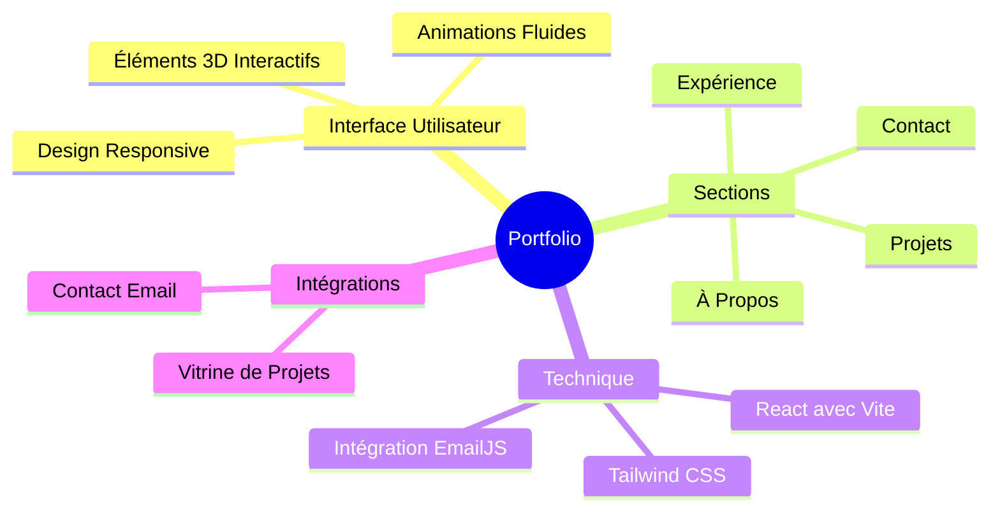

<div align="center">


<p align="center">
  <a href="#features">Fonctionnalités</a> •
  <a href="#demo">Démo</a> •
  <a href="#screenshots">Aperçu</a> •
  <a href="#installation">Installation</a> •
  <a href="#tech-stack">Technologies</a>
</p>

[](LICENSE)
[](https://reactjs.org)

<p align="center">Un portfolio moderne et responsive présentant mon parcours professionnel, mes projets et mes compétences. Construit avec React, Vite et Tailwind CSS, intégrant des animations fluides et des éléments 3D interactifs. ✨</p>

</div>

## ✨ Fonctionnalités

<div align="center">



</div>

## 🚀 Démo

Découvrez mon portfolio en ligne : [Lien vers la démo](https://github.com/bensmailfati11)

## 🛠️ Installation

1️⃣ Clone the repository:

```bash
git clone https://github.com/lohitkolluri/Portfolio-Website
```

2️⃣ Navigate to project directory:

```bash
cd Portfolio-Website
```

3️⃣ Install dependencies:

```bash
npm install
```

4️⃣ Run development server:

```bash
npm run dev
```

5️⃣ Open in browser:

- Visit [http://localhost:3000](http://localhost:3000)

## 💻 Tech Stack

<table align="center">
  <tr>
    <td align="center" width="96">
      
      <br>React
    </td>
      <td align="center" width="96">
      
      <br>Vite
    </td>
    <td align="center" width="96">
      
      <br>Tailwind CSS
    </td>
      <td align="center" width="96">
      
      <br>Three.js
    </td>
  </tr>
</table>

## ⚡ Fonctionnalités Principales

- 📱 Design Responsive

  - Approche Mobile-first
  - Expérience fluide sur tous les appareils
  - Mises en page et composants adaptatifs

- 🎯 Contenu Dynamique

  - Vitrine de projets interactive
  - Section expérience engageante
  - Représentation animée des compétences

- 🎨 UI/UX Moderne

  - Animations fluides avec Framer Motion
  - Navigation intuitive
  - Design propre et professionnel
  - Éléments 3D interactifs utilisant Three.js

- ✉️ Intégration Email
  - Formulaire de contact utilisant EmailJS

## 📄 Licence

<div align="center">

MIT License © [Fatima Zahra Bensmail](LICENSE)


</div>
