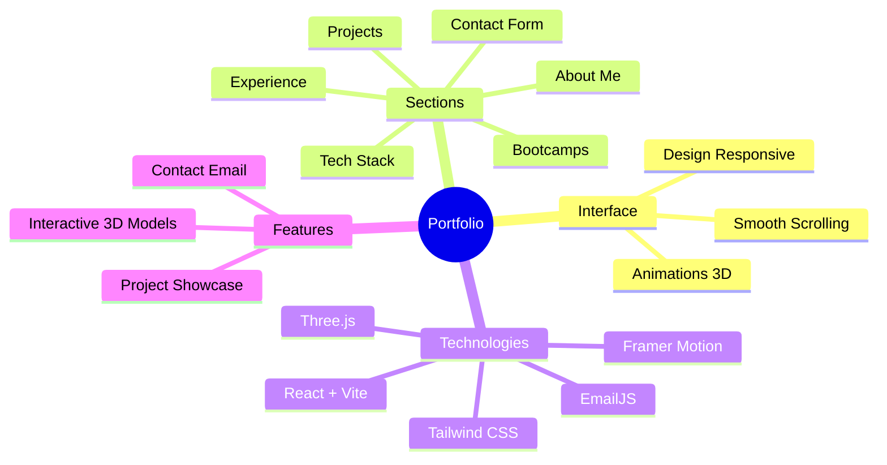

<div align="center">


<h3>💻 Développeuse Web Junior | MERN Stack</h3>

<p align="center">
  <a href="#about">À Propos</a> •
  <a href="#features">Fonctionnalités</a> •
  <a href="#demo">Démo</a> •
  <a href="#tech-stack">Technologies</a> •
  <a href="#installation">Installation</a> •
  <a href="#contact">Contact</a>
</p>

[](LICENSE)
[](https://reactjs.org)
[](https://portfolio-eight-nu-v0qypdvlqi.vercel.app)

<p align="center">Portfolio personnel moderne et interactif présentant mes compétences en développement web, mes projets et mon parcours professionnel. Créé avec React, Vite, Tailwind CSS et Three.js pour une expérience utilisateur immersive. ✨</p>

</div>

---

## 🙋‍♀️ About Me {#about}

Je suis **Fatima Zahra Bensmail**, développeuse web junior passionnée par la création d'applications web modernes et responsives. Spécialisée dans le **MERN Stack** (MongoDB, Express, React, Node.js), je cherche constamment à apprendre et à améliorer mes compétences.

🎓 **Formation** : Développement Web Full Stack  
📍 **Localisation** : Casablanca, Maroc  
💼 **Statut** : Ouverte aux opportunités  
📧 **Contact** : bensmail.fatimazahra.pro@gmail.com

---

## 🌟 Features {#features}

<div align="center">



</div>

### ✨ Fonctionnalités Principales

- 🎨 **Interface Moderne** : Design épuré avec animations fluides et éléments 3D interactifs
- 📱 **Responsive Design** : Optimisé pour tous les appareils (mobile, tablette, desktop)
- 🚀 **Performance** : Chargement rapide grâce à Vite et optimisations
- 📧 **Formulaire de Contact** : Intégration EmailJS pour recevoir les messages directement
- 💼 **Showcase de Projets** : Présentation interactive de mes réalisations
- 🎓 **Parcours Professionnel** : Timeline des expériences et formations
- 🛠️ **Stack Technologique** : Visualisation 3D des technologies maîtrisées

---

## 🚀 Demo {#demo}

### 🌐 Site en Ligne
**Visitez mon portfolio** : [https://portfolio-eight-nu-v0qypdvlqi.vercel.app](https://portfolio-eight-nu-v0qypdvlqi.vercel.app)

### 📸 Screenshots

*Portfolio moderne avec animations 3D et design responsive*

---

## 💻 Tech Stack {#tech-stack}

<div align="center">

### Frontend
<table>
  <tr>
    <td align="center" width="96">
      
      <br>React 18
    </td>
    <td align="center" width="96">
      
      <br>Vite
    </td>
    <td align="center" width="96">
      
      <br>Tailwind CSS
    </td>
    <td align="center" width="96">
      
      <br>Three.js
    </td>
  </tr>
</table>

### Backend & Services
<table>
  <tr>
    <td align="center" width="96">
      
      <br>Node.js
    </td>
    <td align="center" width="96">
      
      <br>MongoDB
    </td>
    <td align="center" width="96">
      
      <br>Express
    </td>
  </tr>
</table>

### Tools & Deployment
<table>
  <tr>
    <td align="center" width="96">
      
      <br>Git
    </td>
    <td align="center" width="96">
      
      <br>GitHub
    </td>
    <td align="center" width="96">
      
      <br>Vercel
    </td>
    <td align="center" width="96">
      
      <br>VS Code
    </td>
  </tr>
</table>

</div>

---

## 🛠️ Installation {#installation}

### Prérequis
- Node.js (v16 ou supérieur)
- npm ou yarn
- Git

### Étapes d'Installation

1️⃣ **Cloner le repository** :
```bash
git clone https://github.com/bensmailfati11/portfolio.git
```

2️⃣ **Naviguer dans le dossier** :
```bash
cd portfolio
```

3️⃣ **Installer les dépendances** :
```bash
npm install
```

4️⃣ **Configurer EmailJS** (optionnel) :
- Créez un compte sur [EmailJS](https://www.emailjs.com/)
- Obtenez vos IDs (Service ID, Template ID, Public Key)
- Mettez à jour `src/components/Contact.jsx` avec vos IDs

5️⃣ **Lancer le serveur de développement** :
```bash
npm run dev
```

6️⃣ **Ouvrir dans le navigateur** :
- Visitez [http://localhost:5173](http://localhost:5173)

### Build pour Production

```bash
npm run build
```

Le dossier `dist/` contiendra les fichiers optimisés pour le déploiement.

---

## 📂 Structure du Projet

```
portfolio/
├── public/               # Fichiers statiques (modèles 3D, images)
│   ├── desktop_pc/      # Modèle 3D laptop
│   ├── planet/          # Modèle 3D planète
│   └── Resume.pdf       # CV téléchargeable
├── src/
│   ├── assets/          # Images et icônes
│   │   ├── projects/    # Images des projets
│   │   ├── tech/        # Icônes technologies
│   │   └── tech-stack/  # Logos langages
│   ├── components/      # Composants React
│   │   ├── canvas/      # Composants 3D (Three.js)
│   │   ├── About.jsx    # Section À propos
│   │   ├── Contact.jsx  # Formulaire de contact
│   │   ├── Experience.jsx
│   │   ├── Hero.jsx     # Page d'accueil
│   │   ├── Navbar.jsx   # Barre de navigation
│   │   ├── Tech.jsx     # Technologies
│   │   └── Works.jsx    # Projets
│   ├── constants/       # Données du portfolio
│   │   └── index.js     # Projets, expériences, etc.
│   ├── hoc/            # Higher Order Components
│   ├── utils/          # Fonctions utilitaires
│   ├── App.jsx         # Composant principal
│   ├── main.jsx        # Point d'entrée
│   └── styles.js       # Styles globaux
├── index.html
├── package.json
├── tailwind.config.js
├── vite.config.js
└── README.md
```

---

## 🎯 Mes Projets Présentés

### 1. **Application MERN - Gestion de Tâches**
Stack : React, Node.js, MongoDB, Express, JWT  
Fonctionnalités : Authentification, CRUD complet, interface responsive

### 2. **Events Organizer API**
Stack : Node.js, Express, Handlebars, MongoDB  
Fonctionnalités : API REST, gestion d'événements, templates serveur

### 3. **Chatbot IA - Assistant Virtuel**
Stack : React, Python, NLP  
Fonctionnalités : IA conversationnelle, recommandations personnalisées (Hackathon)

### 4. **Books Library - Bibliothèque Numérique**
Stack : React, TypeScript, Express, MongoDB  
Fonctionnalités : Catalogue de livres, authentification multi-niveaux

### 5. **Z-Swey3 - Plateforme Communautaire**
Stack : MERN, Git (Travail d'équipe)  
Fonctionnalités : Partage d'événements, commentaires, votes (Hackathon 48h)

### 6. **Portfolio Personnel**
Stack : React, Vite, Tailwind, Three.js  
Fonctionnalités : Site vitrine 3D, formulaire contact EmailJS

---

## 📞 Contact {#contact}

<div align="center">

### 💌 Restons en Contact !

📧 **Email** : [bensmail.fatimazahra.pro@gmail.com](mailto:bensmail.fatimazahra.pro@gmail.com)  
💼 **LinkedIn** : [Fatima Zahra Bensmail](#)  
🐙 **GitHub** : [@bensmailfati11](https://github.com/bensmailfati11)  
🌐 **Portfolio** : [https://portfolio-eight-nu-v0qypdvlqi.vercel.app](https://portfolio-eight-nu-v0qypdvlqi.vercel.app)

</div>

---

## 📄 License

<div align="center">

MIT License © 2025 [Fatima Zahra Bensmail](https://github.com/bensmailfati11)

Ce projet est open source et disponible sous la licence MIT.

---

<p>⭐ Si ce projet vous plaît, n'hésitez pas à lui donner une étoile ! ⭐</p>


</div>
